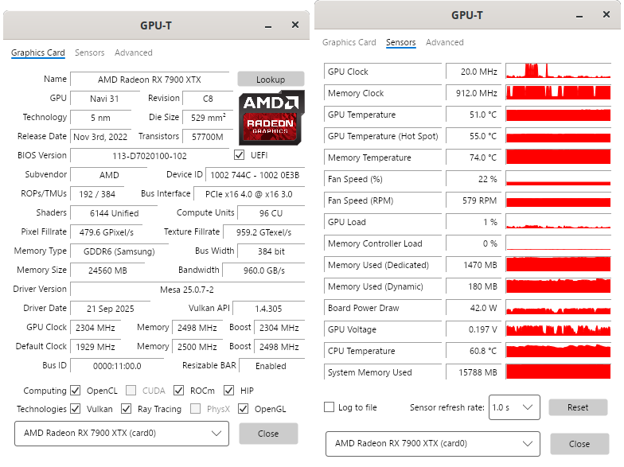

<h1 align="center">
  
  
</h1>

<p align="center">
  <strong>A comprehensive graphics card information utility for Linux.</strong>
</p>

<p align="center">
  
  
  
  
</p>

GPU-T is a modern desktop utility built with **.NET** and **Avalonia UI** designed to provide detailed information about your video card and GPU. It reads directly from the Linux kernel (`sysfs`), graphics APIs and the custom hardware database to display low-level hardware specifications, real-time sensors, and advanced feature support.

<p align="center">
  
</p>

## Why create this?

For years, users on Windows have relied on *GPU-Z* as the gold standard for verifying graphics hardware. It is clean, precise, and tells you exactly what is under the hood.

After switching to **Linux**, I couldn't find a direct alternative that offered the same specific "density" of information in a clean, native GUI. While terminal tools exist, I wanted a dedicated application that mimics the familiarity and utility of GPU-Z: a simple interface, instant hardware lookup, and real-time monitoring. 

GPU-T is my attempt (assisted by AI) to fill that void — providing a diagnostic tool for the Linux open-source ecosystem.

## Features

GPU-T is designed to be a "Single Source of Truth" for your GPU on Linux:

* **Hardware Reconnaissance:** Identifies GPU make, model, revision, die size, transistor count, and release date using a custom, updateable JSON database.
* **Smart Detection (Experimental):** Implements a "Best Match" algorithm that detects specific silicon revisions (e.g., distinguishing between variants of the same chip ID) and warns if an exact match isn't found. *Note: As the algorithm is still being refined, exact GPU model recognition may vary.*
* **Real-time Sensors:** Monitors Clock speeds (GPU/VRAM), Temperatures (Hotspot/Edge), Fan speeds, and Board Power Draw (PPT) in real-time. Allows logging sensor data to a file.
* **Advanced Capabilities:** Checks for support of Vulkan, OpenCL, ROCm, Ray Tracing, etc.
* **Deep Dive:** 
    * **PCIe Resizable BAR** status detection (via direct PCI resource analysis).
    * **BIOS** and Driver version readout.
    * **Memory** type, vendor, and bus width verification.
    * **Vulkan** version, extensions, and features lookup.
    * **OpenCL** version, vendor, and other capabilities lookup.
    * **VA-API** status, including encode & decode capabilities lookup.
* **Vendor-Agnostic Architecture:** Built with a modular architecture. Currently supports **AMD Radeon** GPUs (using `amdgpu` driver), but is designed to support NVIDIA and Intel in the future.
* **TechPowerUp Lookup:** Directly open the TechPowerUp website to verify data about your specific GPU model.

## Supported Hardware

Currently, the application is fully implemented for **AMD Radeon** GPUs on Linux.

- [x] **AMD Radeon** (RDNA GPUs like RX 6000, RX 7000, Vega, Polaris, etc.)
- [ ] **NVIDIA GeForce** (Architecture ready, implementation planned)
- [ ] **Intel Arc** (Architecture ready, implementation planned)

## Roadmap

Please check out the Discussions tab.

## Installation

### 1. Arch Linux (AUR)
Thanks to community maintainers, Arch users can install via the AUR:
```bash
yay -S gpu-t
```
Alternatively, for the unstable development version, use:
```bash
yay -S gpu-t-git
```

### 2. AppMan (AM)
You can install via the `am` package manager:
```bash
am -i gpu-t
```

### 3. Universal AppImage

1.  Download the latest AppImage from the **Releases** tab.
2.  Mark the file as executable: `chmod +x GPU-T.AppImage`.
3.  Run the application.

*Note: No root privileges are required, as the app reads user-accessible paths in `/sys/class/drm`.*

*Note 2: The application has been verified on Debian 13 and Ubuntu 22.04. It is expected to work on most modern Linux distributions.*

## Prerequisites
GPU-T relies on standard Linux utilities to fetch API-specific information. Ensure the following are installed on your system (the app works without these, but will show more info / more accurate info with these):

* `vulkan-tools` (provides `vulkaninfo`)
* `clinfo` (for OpenCL detection)
* `mesa-utils` (provides `glxinfo` for OpenGL)
* `vainfo` (for Multimedia capabilities readout)
* `pciutils` (provides `lspci` for ReBAR detection)


## Building from Source

Requirements: **.NET SDK 9.0 or newer**.

1.  Clone the repository:
    ```bash
    git clone https://github.com/lseurttyuu/GPU-T
    cd GPU-T
    ```
2.  Restore dependencies and build:
    ```bash
    dotnet build
    ```
3.  Run the application:
    ```bash
    dotnet run
    ```

## Architecture

For developers interested in the code, GPU-T uses a clean **MVVM** architecture with a focus on modularity:

* **Services Layer:** Separated into `Probes` (hardware polling), `Advanced` (API providers), and `Utilities`.
* **Factory Pattern:** A `GpuProbeFactory` determines the GPU vendor at runtime and injects the correct logic (e.g., `LinuxAmdGpuProbe`), making it easy to add Nvidia/Intel support in the future practically without touching the UI code.
* **Database:** A local JSON database handles static specs, supporting user overrides and updates (when provided) for new hardware definitions. Want to modify the database that your GPU-T uses? Just head over to `~/.local/share/GPU-T/` and modify the JSON file.

## Built With

* **[.NET](https://dotnet.microsoft.com/)** - The underlying cross-platform framework.
* **[Avalonia UI](https://avaloniaui.net/)** - For the pixel-perfect, cross-platform user interface.
* **[CommunityToolkit.Mvvm](https://github.com/CommunityToolkit/dotnet)** - Provides the MVVM architecture helpers (Observables, Commands).

## Contributing

Contributions are welcome! If you have an NVIDIA or Intel GPU and want to help implement the NVIDIA/Intel GPUs support, feel free to open a Pull Request. Want to discuss new features? Head over to the Discussions tab.

## Acknowledgements, Credits & Disclaimer

This project is heavily inspired by **GPU-Z** by **TechPowerUp**. It is not an official port, nor is it affiliated with TechPowerUp in any way. GPU-T is a tool designed for Linux users who miss the clarity and utility of the original Windows tool.

Special thanks to the TechPowerUp team for setting the standard in GPU diagnostics and maintaining the extensive [GPU Database](https://www.techpowerup.com/gpu-specs/), which this application links to via the "Lookup" button.

### Community Credits:
* **yobson** - for submitting and maintaining the AUR package.
* **yochananmarqos** - for submitting and maintaining the AUR package (stable).
* **dCo3lh0** - for adding GPU-T to the AppMan (AM) database.
* The **r/linux_gaming** community for the incredible feedback and support!

---
<p align="center">
  Created with ❤️ for the Linux Community.
</p>